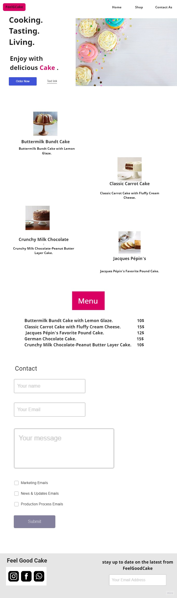

# Feel Good Cake

>## dishes of the restaurant
>
>>
Buttermilk Bundt Cake with Lemon Glaze

>
>>
Classic Carrot Cake with Fluffy Cream Cheese

>
>>
Jacques Pépin's Favorite Pound Cake

>
>>
German Chocolate Cake

>
>>
Crunchy Milk Chocolate-Peanut Butter Layer Cake

>
---
> ## Restaurant Menu
> - Buttermilk Bundt Cake with Lemon Glaze.
> - Classic Carrot Cake with Fluffy Cream Cheese.
> - Jacques Pépin's Favorite Pound Cake.
> - German Chocolate Cake.
> - Crunchy Milk Chocolate-Peanut Butter Layer Cake.
>
>  Enjoy with delicious **CAKE**.
https://www.foodandwine.com/desserts/cake/cakes
---
My favorite restaurant cake is [Feel Good Cake](https://github.com/OmarQatt/my-restaurant "The best restaurant for a cake").

What observations or questions do you have about what you’ve learned so far?
about divide section and how use display 

How long did it take you to complete this assignment? And, before you started,
how long did you think it would take you to complete this assignment?

to 10pm and im not finish the Requirements 4 tommorw when i learn more about html i solved it easly 
 BIN +140 KB 
wireframe.jpg